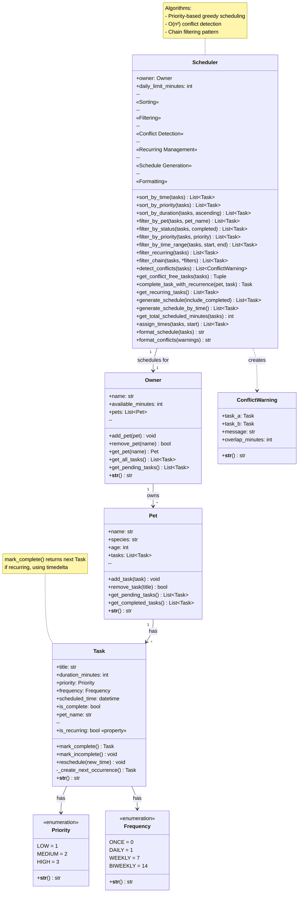
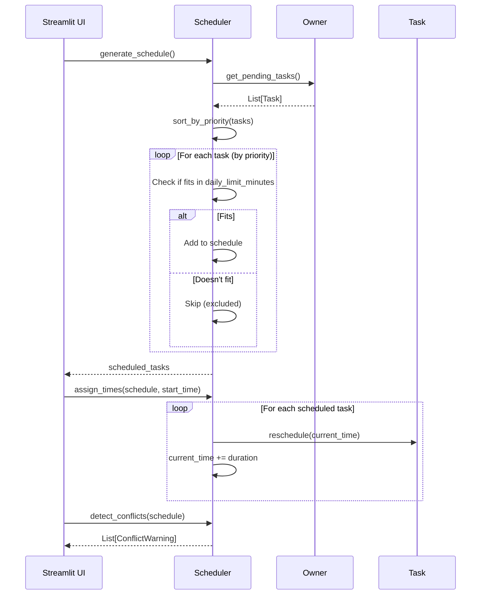
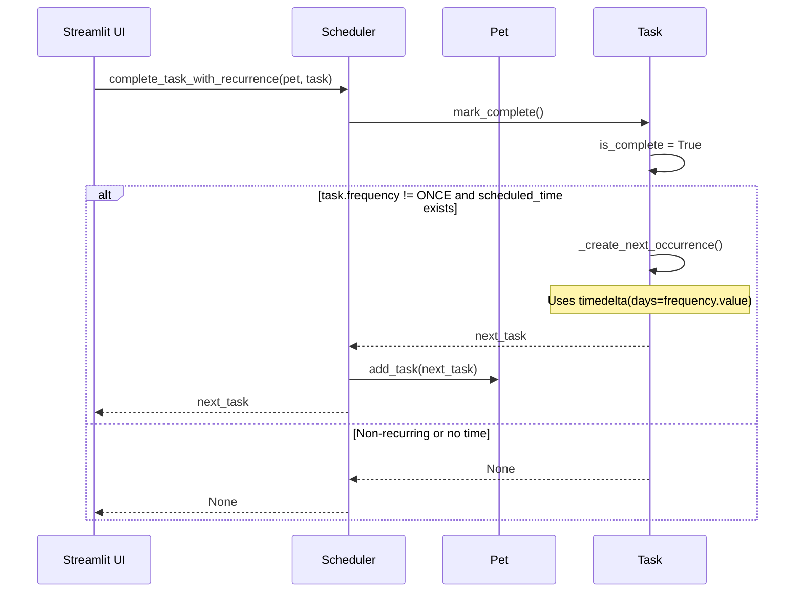
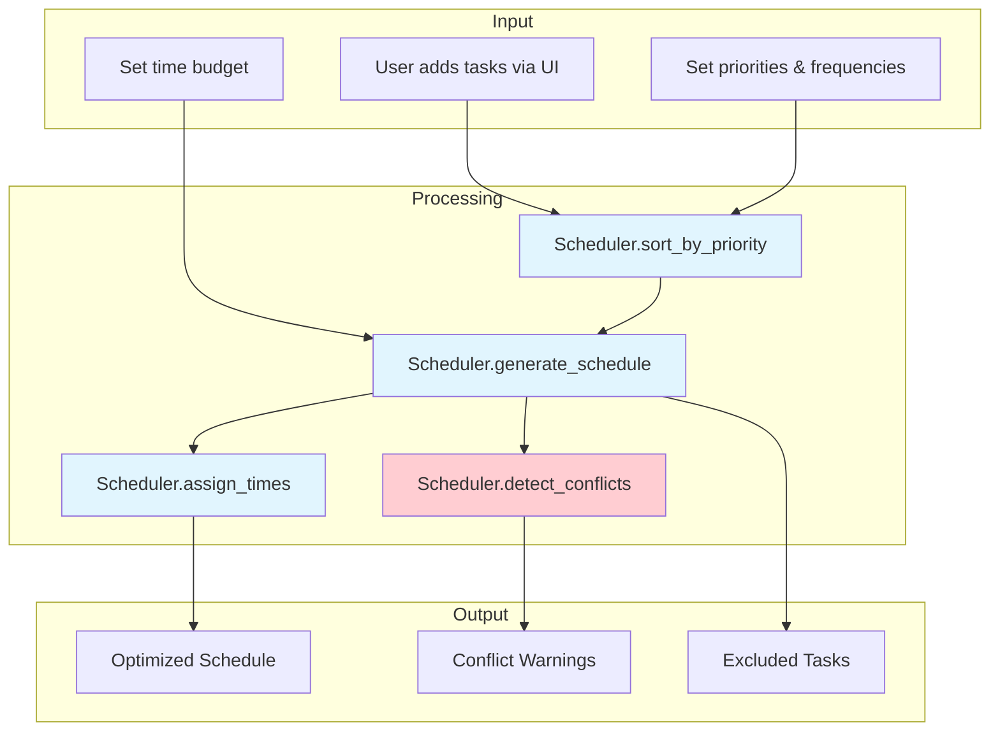

# PawPal+ Final UML Diagram

## Class Diagram (Mermaid.js)

## Sequence Diagram: Generate Schedule

## Sequence Diagram: Complete Recurring Task

## Data Flow Diagram

---

## Key Design Decisions

1. **Task.pet_name field**: Added to maintain back-reference when tasks are flattened via `Owner.get_all_tasks()`

2. **Frequency enum**: Replaced boolean `is_recurring` with enum for multiple recurrence options (DAILY=1, WEEKLY=7, BIWEEKLY=14)

3. **ConflictWarning dataclass**: Encapsulates conflict info including overlap duration calculation

4. **Scheduler as algorithm container**: All sorting/filtering/scheduling logic centralized in one class

5. **Immutable sorting**: All sort/filter methods return new lists, don't modify originals
